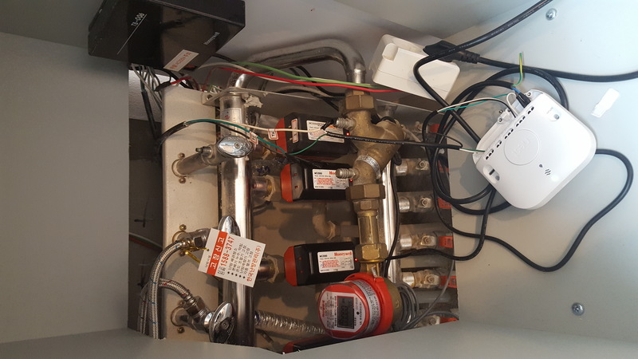
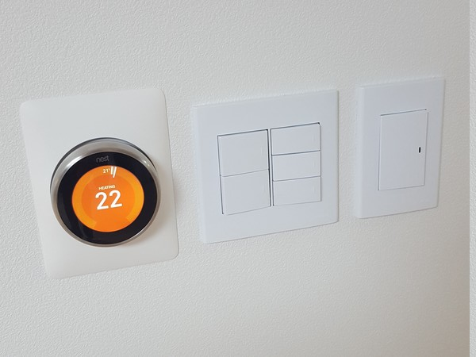

## 목적
* 이뻐서

## 현재 환경
* 아파트 지역난방 (중앙난방)
* 4개 Zone으로 구성됨.
  * 안방, 거실+부엌, 작은방1, 작은방2
* 각방 벽에 있는 온도조절기는 Honeywell의 DT100이 설치되어 있음
* 분배기에 있는 구동기는 Honeywell의 MC2000이 4개 설치되어 있음
* 구동기와 조절기는 Honeywell의 TB-006 단자함 안에서 연결되어 있음

## 알아야 할 지식
* 전기선
  * 교류방식에서는 N(Neutral), L(Live) 선을 사용한다.
* 난방 분배기 구조
  * 분배기: 보통 싱크대 밑에 있는 무섭게 생긴 놈. 중앙 난방에서 보내준 난방 온수가 분배기를 통해 각방으로 갔다가 다시 분배기로 돌아와서 중앙 난방으로 돌아 간다.
  * 구동기: 밸브를 열고 닫고 해주는 놈. 분배기에 붙어 있다.
  * 조절기: 온도센서가 있어서 현재 방의 온도가 지정한 온도보다 낮으면 구동기에 신호를 보내 밸브를 열게 한다. 온도가 지정 온도에 도달하게 되면 다시 구동기에 신호를 보내 밸브를 닫는다.

## 네스트 설치 전략(?)
* 네스트 유럽형 3세대 사용
### 전략-1: DT100 조절기를 모두 네스트로 교체
* 현재 설치되어 있는 조절기 4개를 모두 네스트로 교체
* 네스트가 멀티존을 지원하지 않기 때문에 네스트 4개를 구매해야 함
* **비용 문제로 탈락**

### 전략-2: 조절기 하나로 모든 구역을 동일하게 제어
* 분배기에 메인 구동기를 추가로 설치하고 네스트로 제어
* 각방 분배기는 모두 열어놓고 기존 조절기는 모두 바보로 만들기
* **각방의 온도에 따라 따로 조절되는 것이 더 효율적임 (남향방/북향방 온도차이 있음)**
* **이쁜것(네스트)을 위해 효율을 포기해야 함**
* **메인 구동기 추가 설치에 따른 비용 발생으로 탈락**

### 전략-3: 2개 공간을 묶어서 제어
* 작은방1, 작은방2는 기존 DT100 조절기 사용.
* 안방 온도조절기 제거. 거실에 네스트 설치. 거실 온도 기준으로 거실과 안방을 같이 제어
* 히트링크의 1,2,3선을 거실 구동기와 안방 구동기에 같이 연결하면 가능
* **안방의 실제 온도와 상관없이 거실 온도 기준으로 동작하기 때문에 역시 효율은 떨어짐**
* **구동기 2개를 히트링크 하나로 제어해야 하는 삽질을 해야함. 될 것 같지만, 아직 시도해본 사람을 못찾아음**

### 전략-4: 주 거주공간인 거실만 네스트로 교체
* 안방, 작은방1, 작은방2는 기존 DT100 조절기 사용. 거실만 네스트로 교체
* 돈이 더 생기면 방들도 모두 네스트로 교체
* **삽질에 대한 위험비용 최소화**

## 각 모듈별 연결 계획
* 분배기의 거실 구동기(MC2000) ---- 히트링크 ---- 네스트

### 히트링크와 네스트
* 히트링크와 네스트는 Zigbee로 무선통신이 되기 때문에 전원만 네스트에 공급하면 사용 가능
* 네스트의 전원 공급 방법은 아래 2가지가 있음
  * USB: USB선이 네스트 밖으로 나와서 안이쁨 (벽에 매립 안하고 스탠드에 올려놓고 쓸때 사용)
  * T1,T2: 히트링크로부터 전원을 공급받음 (12v DC)
* 어차피 거실벽에 DT100이 있고, 이걸 뜯어내면 3개 선(녹색, 검정색, 하얀색)이 분배기까지 이어져 있음
* 3개 선중 2개를 T1,T2(히트링크와 네스트 12v DC 전원 연결선)로 사용하기로 함.

### 구동기(MC2000)와 히트링크(구멍 1,2,3)
* TB-006 단자함에서 기존 거실용 구동기/온도조절기 관련된 선을 모두 뽑아버림.
  * MC2000용 선 3개, DT100용 선 3개 나옴
* MC2000은 3개의 선(녹색, 검정색, 하얀색)을 사용함.
  * 녹색: N
  * 하얀색: L
  * 검정색: Switch
* 히트링크 구멍 1,2,3
  * 1(Satisfied:Optional): 릴레이의 NC 역할. 일단 사용하지 않기로 함
  * 2(Common): 릴레이의 C 역할. L과 연결
  * 3(Call-for-heat): 릴레이의 NO 역할. MC2000의 검정색과 연결
### 히트링크 전원(구멍 N,L)
* 기존에 버려뒀던 컴퓨터 파워선을 잘라내면 3개 선이 들어 있음. 파란색과 갈색선을 히트링크의 N,L에 연결
  * 파란색: N
  * 갈색: L
  * 녹색/노란색 섞임: 그라운드
### 네스트 전원(구멍 T1,T2)
* 거실벽에서 DT100 제거후 남아있던 선 3개중 2개를 T1,T2에 연결

## 최종 연결도
* 컴퓨터 파워선
  * N: 히트링크 N과 MC2000 녹색선에 연결
  * L: 히트링크 L과 MC2000 하얀색선에 연결
* 히트링크
  * 2: 히트링크 L과 연결
  * 3: MC2000 검정색선과 연결
  * T1: 네스트 T1과 연결
  * T2: 네스트 T2와 연결

## 완성

----

## 참고 사이트
* https://github.com/chaeplin/nest-heat-link-at-korea
* http://blog.naver.com/PostView.nhn?blogId=fuls&logNo=220977143169&parentCategoryNo=&categoryNo=&viewDate=&isShowPopularPosts=false&from=postView
* https://www.clien.net/service/board/use/9200765
* http://blog.daum.net/sejuni2002/266
* http://blog.naver.com/eztcpcom/220577497027

## 주의
* **반드시 차단기 내리고 작업.**
* 전기 관련 지식이 전무한 상태에서 여기저기 찾아가면서 작업한 것이기 때문에 틀린 내용이 있을 수 있음.
* 이 문서는 개인적인 작업의 기록이고 이 문서로 인해 발생한 어떤 사고에도 책임을 지지 않음.

